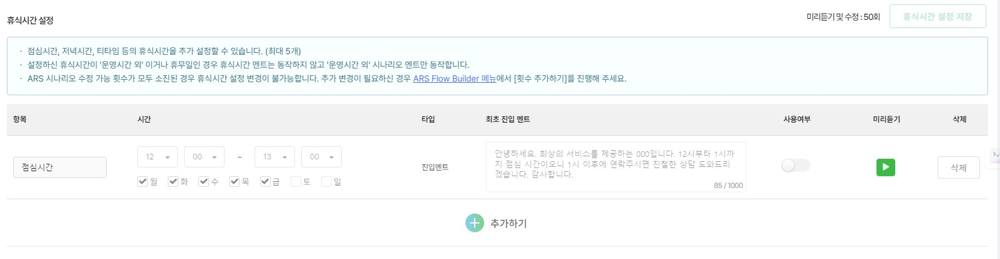

# 운영시간

## ARS 운영시간 관리

좌측 운영관리> 운영시간/휴무일 관리 > 운영시간 메뉴에서 ARS 운영시간을 등록해 주세요.\
✔️ 기본 업무 시간을 설정해 주세요.


**휴일** 또는 **설정한 근무시간 외 시간**에는 업무 외 시간 응대 시나리오가 동작합니다.


<figure><figcaption></figcaption></figure>

**✔️ 휴식 시간**을 설정해 주세요.


**기본 업무 시간 내에** 휴식, 점심시간 등의 휴게시간을 최대 5개까지 설정하실 수 있습니다.


<figure><figcaption></figcaption></figure>

* 프리미엄 보이스를 사용중인 경우 휴식시간 멘트도 프리미엄 보이스 설정에 포함됩니다.
* Multi Depth ARS를 사용중인 경우 ‘휴식시간＇은 Multi Depth Builder에서 설정할 수 있습니다.
* 설정이 끝나면 반드시 저장 버튼을 눌러주세요!
