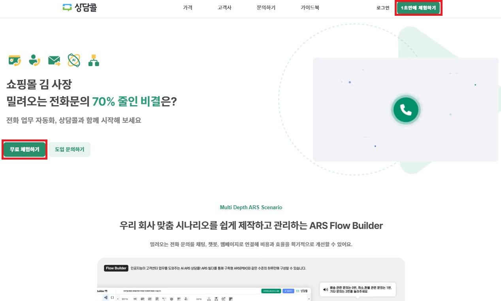
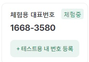

# 무료 체험

상담콜을 처음 접하는 분이라면 [‘1](https://ars.happytalk.io/app/join)[초만에 체험하기](https://ars.happytalk.io/app/join)[＇](https://ars.happytalk.io/app/join)를 통해 7일간 무료로 체험해 보세요. 💙

## [1. 상담콜 체험서비스](https://ars.happytalk.io)

**7일간 무료**로 상담콜 서비스를 체험해 볼 수 있습니다.

<figure><figcaption></figcaption></figure>

<figure><figcaption></figcaption></figure>

간단한 회원 가입 이후에 이메일 인증을 완료 해주세요.\
인증 완료 후에, 시작 가이드에 따라 간단한 설정을 진행합니다.

※ 카카오톡 또는 네이버 아이디로 간편가입 기능을 통해 빠르게 아이디를 생성할 수 있습니다.

<figure><figcaption>
상담콜 시작 가이드
</figcaption></figure>


ARS를 체험할 수 있는 전화번호를 등록해 주세요.


<figure><figcaption>
체험할 전화번호 입력창
</figcaption></figure>

위 설정을 건너 뛰었다면 좌측 대표번호 영역에 \[테스트용 내 번호 등록] 버튼을 통해 설정 가능합니다.😊

<figure><figcaption>
상담콜 체험 버전
</figcaption></figure>


체험용 전화번호가 휴대폰번호일 경우 알림톡 메시지가 전송됩니다.


<figure><figcaption>
알림톡 발송 안내화면
</figcaption></figure>

체험용 전화번호 등록을 완료하시면 가이드에 따라 추가 설정을 진행해 주세요.

<figure><figcaption></figcaption></figure>

상담콜 체험서비스에서 제공되는 전국 대표번호는 ‘체험서비스＇용으로\
상담콜 체험서비스를 이용하시는 모든 고객님들이 공통으로 사용하는 대표번호입니다.

<figure><figcaption></figcaption></figure>


**등록하신 체험용 전화번호로 위 대표 번호에** 전화를 걸어보세요!

✌🏻체험버전에서 설정하신 ARS 시나리오가 잘 나오는지 확인할 수 있습니다.


사용하면서 궁금한 점이 있으시면 언제든지 [**해피톡 고객센터**](https://design.happytalkio.com/chatting?siteId=4000000015\&siteName=%ED%95%B4%ED%94%BC%ED%86%A1\&categoryId=61504\&divisionId=61505)로 문의 주세요. 💙

## [2. 카페24](https://store.cafe24.com/kr/apps/2504)

카페24 쇼핑몰 이용자는 **카페24 앱스토어 내 상담콜 앱**을 설치하여 사용할 수 있는데요.\
**7일간 무료**로 상담콜 서비스를 체험해 보실 수 있습니다.

* **카페24 앱스토어**에서 '[**상담콜 (전화 채팅 결합 ARS 서비스)**](https://store.cafe24.com/kr/apps/2504)' 앱을 쇼핑몰 아이디 입력 후, 설치해 주세요. 접근 권한까지 동의를 마쳐야 설치가 완료됩니다.

<figure><figcaption>
카페24 앱스토어 - 상담콜
</figcaption></figure>

* 설치 후 '**가입하기**'을 통해 가입 정보를 입력해 주세요.

<figure><figcaption></figcaption></figure>

* **이메일 인증을 완료**하시면 체험 서비스를 사용하실 수 있습니다.


'부운영자' 계정은 앱 설치가 불가합니다. '**대표 운영자**' 계정으로 설치해 주세요.



카페24 쇼핑몰이 아닌, **호스팅**만 사용하는 경우 [**상담콜 홈페이지**](https://ars.happytalk.io)에서 직접 가입해 주셔야 합니다.


* 카페24 이용자의 경우 상담콜 아이디는 **"cafe24\_call\_카페24관리자아이디"** 로 자동 지정됩니다.
* 카페24 앱스토어 내 설치한 앱에서 상담콜 앱의 '**관리하기**'를 클릭한 후, '**서비스 시작하기**'로 상담콜에 바로 로그인하여 접속합니다.

## [3. 네이버 스마트스토어](https://solution.smartstore.naver.com/ko/solution/7Xk4Qos0mz0k00Fy8JaQiU/detail)

네이버 스마트스토어 이용자는 **네이버 커머스 솔루션 마켓 내 상담콜 앱**을 설치하여 사용할 수 있는데요.\
7일간 무료로 상담콜 서비스를 체험해 보실 수 있습니다.

* 네이버 커머스솔루션마켓(스마트스토어 앱스토어)에서 [**＇**](https://store.cafe24.com/kr/apps/2504)[**상담콜**](https://store.cafe24.com/kr/apps/2504)**'** 앱을 네이버 커머스 ID로 로그인 후\
  설치해 주세요.

<figure><figcaption>
네이버 커머스 솔루션 마켓 - 상담콜
</figcaption></figure>

* 사용하기를 선택하신 후 스마트스토어센터 > 솔루션 목록 화면으로 이동하시면\
  사용중인 솔루션에'상담콜' 앱을 확인할 수 있습니다.

<figure><figcaption>
스마트스토어센터 - 솔루션 목록
</figcaption></figure>

* 설치 후 '가입하기'을 통해 가입 정보를 입력해 주세요.
* 이메일 인증을 완료하시면 체험 서비스를 사용하실 수 있습니다.

<figure><figcaption></figcaption></figure>

* 네이버 1초  회원가입(네이버  아이디) 또는 일반 회원가입을 통해 직접 아이디를 생성하실 수 있습니다.
